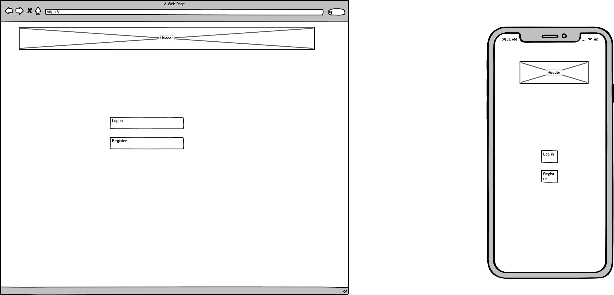
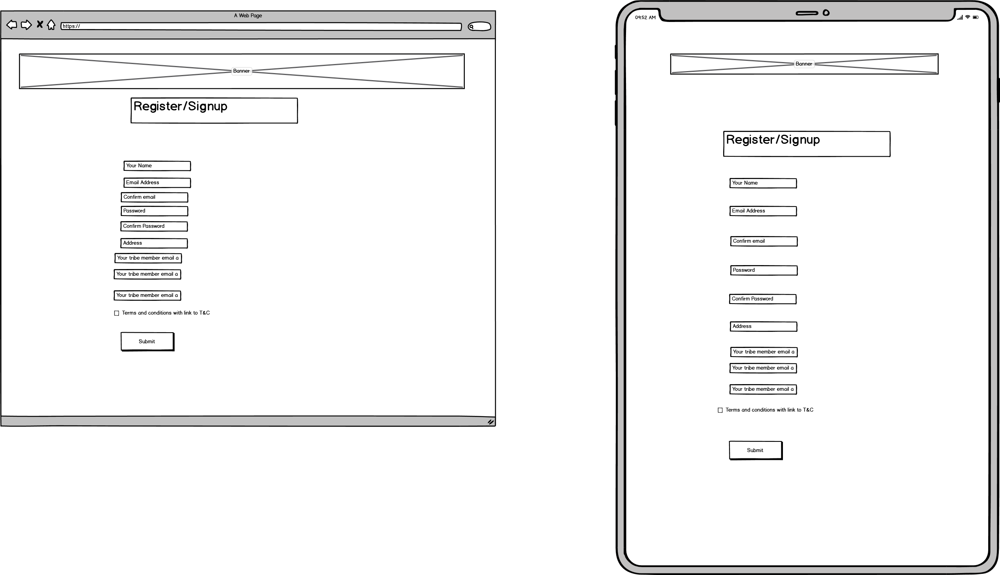
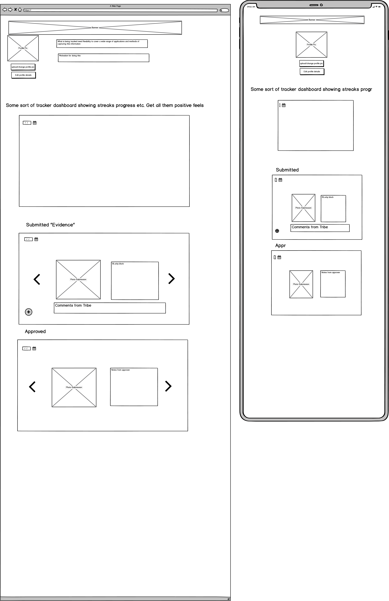
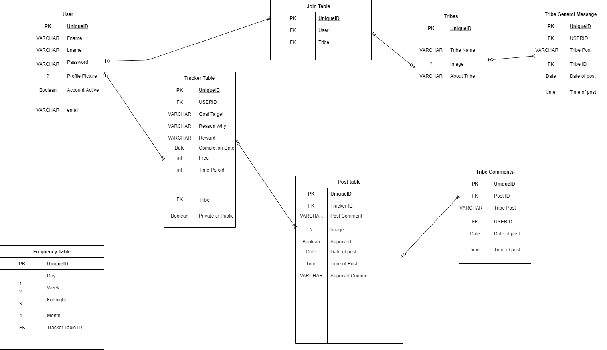

# Tribe accountability
An accountability app for individuals or groups. The purpose of this app is for 
individuals to be held accountable to their goals through friends or acquaintances 
who can monitor the individuals progress to hitting the goals/targets/habits/changes that 
they wish to be accountable for. THis will included a forum type chat section (private and public)
as well as a method of reviewing and approving the individuals actions. At this stage that shall
be via photo approval of the action however depending on what is being tracked there are other avenues to 
explore. The idea is that the Tribe helps to hold eachother accountable and lift people.

A group accountability function is also going to be implemented so that a team or workplace 
can also hold eachother accountable to the team goals/culture/habits with a similar functionality 
to the individual one.

There will be a penalty system and ideally this will be based on the agreements with the people holding
the others accountable. However in the future we shall explore other ways to help leverage people's own
bias and dislikes to achieve the changes they are looking for. 

## Trello Board

https://trello.com/b/Fxw5zdjP/side-project-tribe

## Wireframes

The wireframes are still a work in progress with the minimum viable product currently on display further features shall
be added at a later time with information regarding this below

### Homepage

The home page is very simple with a log in and sign up button. An inspirational background pic. Also 
metrics showing people hitting goals could be a feature in future releases. Menu for further navigation once more features are added.

### User Signup

### Profile Page

The profile page also features the dashboard and this is where the action happens.
The page will have the options to upload photos and edit details of the profile.
It will be where the items being tracked are located as well as the place that feedback is given and approval is done.
There shall be some sort of tracker showing metrics and streaks at the top of the page with an option for dates. 
Possible feature shall be for filtering this by month etc week.

It will be where evidence as such is submitted and these submissions will have a place for comments
from the "tribe" for feedback or encouragement etc.

The last dashboard will be the approval of the submissions which will be positive/negative
or a null for no submission which will also be a negative.

## Database Design

### Database ERD Scehma Draft v 1.0

The database schema is in its first draft showing the table relationships. There is a pretty consistent flow of the table relationships with the main significant connection being the many to many relationship between the tribes and the users. As I look into the future I shall be looking to implement a group setting for people. At this stage the option of a tracker to be public is the work around and others to be able to join in.

At this stage I shall be creating the user table and implementing the CRUD resources around it.

## Endpoints

Copy the contents of the file swagger.yml. Navigate to https://editor.swagger.io/#

remove the contents that has been populated and past the new data. This will show the endpoints that are there currently. 

## Installation

### Dependancies

Create a new directory and cd into it
* Clone git repo
* If not running python 3.8, run the following bash commands

* sudo apt update
* sudo apt install python3.8
* Create a virtual enviornment
* sudo apt-get install python3-pip
* sudo apt-get install python3-venv
* python3 -m venv venv
* source venv/bin/activate
* Install the modules in requirements.txt
* cd into folder
* pip install -r requirements.txt
* Run the Program
* cd src
* python main.py

## CI/CD

### Dev branch

The CI/CD for this project shall involved running automated testing using unittest, flake8 and mypy,
this shall be updated and altered as other tests or modules become more relevant. The CI pipeline shall push to 
Github. From there the application shall be deployed to an EC2 instance with an elastic IP. The application shall be 
tested on the EC2 instance for bugs manually before being rolled out to produciton

### Main/Master Branch

This shall be as above on a seperate EC2 instance that is conceptually ready as a server ready to run the app for public consumption